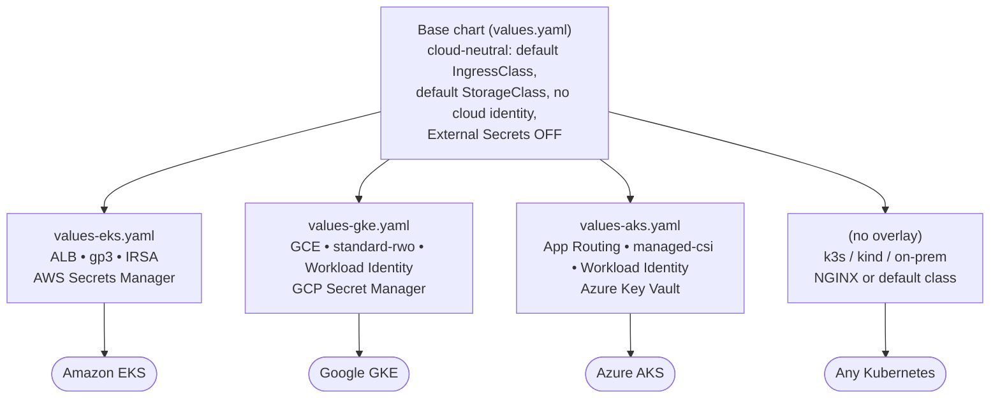
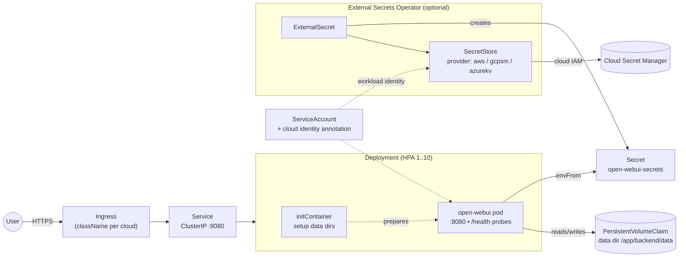

# Open WebUI Helm Chart

[](https://github.com/Dzhan85/openwebui-helm-chart/actions/workflows/lint.yml)

This Helm chart deploys [Open WebUI](https://github.com/open-webui/open-webui) on **any conformant Kubernetes cluster** — Amazon EKS, Google GKE, Azure AKS, or self-managed (k3s, kind, on-prem). This is the main web-based chat interface for interacting with various LLM backends including Ollama, OpenAI, and other OpenAI-compatible APIs.

The chart ships **cloud-neutral defaults** so a plain `helm install` works everywhere, plus **per-cloud overlay values files** that layer in managed load balancers, cloud identity (IRSA / Workload Identity), storage classes, and secret managers.

## Architecture

### Portable core + per-cloud overlays

The base chart renders only vendor-neutral Kubernetes objects. Each overlay
values file swaps in the four cloud-specific dimensions — ingress class, storage
class, service-account identity, and the External Secrets provider — without
touching the templates.



### In-cluster runtime topology



## What is Open WebUI?

Open WebUI is a feature-rich web interface for Large Language Models that provides:
- Modern chat-based interface for AI interactions
- User authentication and multi-user support
- Conversation history and management
- Support for multiple LLM backends (Ollama, OpenAI, Azure OpenAI, etc.)
- Document uploads and processing (PDF, XLSX, etc.)
- Model management and configuration
- Runs on port 8080
- Uses the `ghcr.io/open-webui/open-webui` image

**When to use this chart:**
- You need a full-featured web-based AI chat interface
- Multiple users will be accessing the system
- You want conversation history and management
- Document processing and uploads are required
- Running a production AI chatbot service

**For terminal-style interface**, see the `openwebui-terminal` chart.

## Prerequisites

- Any Kubernetes cluster, v1.23+ (EKS, GKE, AKS, k3s, kind, on-prem)
- Helm 3.x
- A default `StorageClass` (every managed cloud provides one) for persistence
- An ingress controller if you enable ingress (see per-cloud notes below)

Cloud-specific integrations are **optional** and only needed when you use the
matching overlay: AWS Load Balancer Controller (EKS ALB), GKE Ingress (GCLB),
AKS application routing / Application Gateway, and — if you turn on External
Secrets — the External Secrets Operator plus the cloud's secret manager.

## Installation

The chart is cloud-neutral by default. Pick the workflow that matches your target:

```bash
# Portable install — works on any cluster (uses default StorageClass,
# default IngressClass, no cloud identity or secret-manager wiring)
helm install open-webui ./open-webui

# Amazon EKS (ALB ingress, gp3 EBS, IRSA, AWS Secrets Manager)
helm install open-webui ./open-webui -f open-webui/values-eks.yaml

# Google GKE (GCE ingress, PD storage, Workload Identity, GCP Secret Manager)
helm install open-webui ./open-webui -f open-webui/values-gke.yaml

# Azure AKS (app routing ingress, managed-csi, Workload Identity, Key Vault)
helm install open-webui ./open-webui -f open-webui/values-aks.yaml
```

Each overlay contains placeholder values (role ARNs, certificate references,
project IDs, vault URLs, domains) that you must replace for your environment.
You can also layer your own file on top, e.g.
`-f open-webui/values-eks.yaml -f my-overrides.yaml`.

### Multi-cloud building blocks

The base `values.yaml` keeps every cloud-specific hook empty/off so nothing is
provider-locked. Each overlay fills in only these dimensions:

| Dimension | Portable default | EKS | GKE | AKS |
|-----------|------------------|-----|-----|-----|
| Ingress class | `""` (cluster default) | `alb` | `gce` | `webapprouting.kubernetes.io` |
| Storage class | `""` (cluster default) | `gp3` | `standard-rwo` | `managed-csi` |
| SA identity annotation | none | IRSA role ARN | GKE Workload Identity | AAD Workload Identity |
| Secret manager | disabled | AWS Secrets Manager | GCP Secret Manager | Azure Key Vault |

The `SecretStore` template passes its `provider` block through verbatim, so any
External Secrets Operator provider (aws / gcpsm / azurekv / vault / kubernetes)
works without template changes.

## Configuration

### Key Configuration Options

| Parameter | Description | Default |
|-----------|-------------|---------|
| `replicaCount` | Number of replicas | `1` |
| `image.repository` | Open WebUI image repository | `ghcr.io/open-webui/open-webui` |
| `image.tag` | Image tag | `main` |
| `image.pullPolicy` | Image pull policy | `IfNotPresent` |
| `service.type` | Kubernetes service type | `ClusterIP` |
| `service.port` | Service port | `8080` |
| `ingress.enabled` | Enable ingress | `true` |
| `ingress.className` | Ingress class name | `""` (cluster default) |
| `resources.limits.cpu` | CPU limit | `500m` |
| `resources.limits.memory` | Memory limit | `512Mi` |
| `autoscaling.enabled` | Enable HPA | `true` |
| `autoscaling.minReplicas` | Minimum replicas | `1` |
| `autoscaling.maxReplicas` | Maximum replicas | `100` |
| `persistence.enabled` | Enable persistent volume | `true` |
| `persistence.size` | Persistent volume size | `10Gi` |
| `persistence.storageClass` | Storage class name | `""` (default) |
| `persistence.mountPath` | Data mount path | `/app/backend/data` |

### Key Differences from openwebui-terminal

| Feature | open-webui | openwebui-terminal |
|---------|-------------------|---------------------------|
| **Image** | `ghcr.io/open-webui/open-webui:main` | `ghcr.io/open-webui/open-terminal:latest` |
| **Port** | 8080 | 8000 |
| **Domain** | `openwebui.example.com` | `openwebui-terminal.example.com` |
| **Interface** | Web UI focused | Terminal-focused |
| **Use Case** | Chat and conversation management | CLI-style interactions |
| **Features** | Full web UI, multi-user, document uploads | Terminal-style interface |

### Ingress Configuration

By default `ingress.className` is empty (uses the cluster's default IngressClass)
and no controller annotations are set, so the chart renders a valid Ingress on
any cluster. Choose a controller via an overlay or your own values:

- **EKS** (`values-eks.yaml`): `alb` class + AWS Load Balancer Controller annotations (HTTPS:443, internet-facing, IP targets, ACM cert).
- **GKE** (`values-gke.yaml`): `gce` class + GCLB (managed cert / static IP annotations). Requires `service.type: NodePort` (set in the overlay).
- **AKS** (`values-aks.yaml`): `webapprouting.kubernetes.io` class via the AKS application routing add-on (or `azure-application-gateway` for AGIC).
- **Any cluster**: install an NGINX ingress controller and set `ingress.className: nginx`.

Set your own hostname under `ingress.hosts[].host` and TLS under `ingress.tls`.

### Security Context

The application runs with the following security settings:
- Non-root user (UID: 1654)
- Non-root group (GID: 1654)
- fsGroup: 1654
- No privilege escalation
- Service account: `open-webui-sa` — cloud-neutral by default. Bind a cloud
  identity by adding a `serviceAccount.annotations` entry (IRSA on EKS, Workload
  Identity on GKE/AKS); see the per-cloud overlay files for examples.

### Persistent Storage (CRITICAL)

Open WebUI requires persistent storage to prevent data loss. The chart is configured with:
- **Enabled by default**: `persistence.enabled: true`
- **Volume size**: 10Gi (adjustable based on needs)
- **Mount path**: `/app/backend/data` (contains SQLite database and user data)

**Important:** Without persistent storage, all data (users, chats, settings) will be lost when pods restart.

For AWS EKS, you may want to specify a storage class:
```yaml
persistence:
  storageClass: "gp3"  # or "ebs-sc" depending on your setup
```

### Document Upload and Processing

This chart is configured for enhanced document handling:

```yaml
env:
  - name: MAX_FILE_SIZE
    value: "104857600"  # 100MB max file size
  - name: UPLOAD_DIR
    value: "/app/backend/data/uploads"
  - name: DATA_DIR
    value: "/app/backend/data"
  - name: FILE_UPLOAD_TIMEOUT
    value: "600"  # 10 minutes for large files
```

**Supported File Types:**
- PDF documents
- Excel files (XLSX, XLS)
- Word documents (DOCX)
- Text files
- And more

**NLTK Configuration:**
- Custom NLTK data path: `/app/backend/data/nltk_data`
- Enables natural language processing features
- Data persists across pod restarts

### Environment Variables

Configure Open WebUI through environment variables:

#### Ollama Backend
```yaml
env:
  - name: OLLAMA_BASE_URL
    value: "http://ollama-service:11434"
```

#### OpenAI API
```yaml
env:
  - name: OPENAI_API_KEY
    valueFrom:
      secretKeyRef:
        name: openai-secret
        key: api-key
```

#### Offline Mode
```yaml
env:
  - name: HF_HUB_OFFLINE
    value: "1"
```

#### Custom Branding
```yaml
env:
  - name: WEBUI_NAME
    value: "Open WebUI"  # Custom name displayed in the UI
```

### External Secrets (Optional)

External Secrets Operator (ESO) integration is available but **disabled by
default** (the base chart stays portable and dependency-free). It works with any
ESO provider because the `SecretStore` `provider` block is passed through
verbatim. Enable it in your own values or use a cloud overlay:

```yaml
secretStore:
  enabled: true
  name: "open-webui-secret-store"
  provider:            # any ESO provider: aws / gcpsm / azurekv / vault / kubernetes
    aws:
      service: SecretsManager
      region: us-west-2
      auth:
        jwt:
          serviceAccountRef:
            name: open-webui-sa

externalSecrets:
  enabled: true
  name: "open-webui-external-secret"
  secretStoreRef:
    name: "open-webui-secret-store"
    kind: SecretStore
  target:
    name: "open-webui-secrets"   # injected into the pod via envFrom
  data:
    - secretKey: WEBUI_SECRET_KEY
      remoteRef:
        key: open-webui/prod
        property: WEBUI_SECRET_KEY
```

Ready-made provider blocks for AWS Secrets Manager, GCP Secret Manager, and Azure
Key Vault live in `values-eks.yaml`, `values-gke.yaml`, and `values-aks.yaml`.

## Customization

To customize the deployment, modify the `values.yaml` file or provide your own values file:

```bash
helm install open-webui . -f custom-values.yaml
```

## Uninstallation

```bash
helm uninstall open-webui
```

## Troubleshooting

### Check pod status
```bash
kubectl get pods -l app.kubernetes.io/name=open-webui
```

### View logs
```bash
kubectl logs -l app.kubernetes.io/name=open-webui -f
```

### Check ingress
```bash
kubectl get ingress
kubectl describe ingress open-webui
```

### Check the load balancer controller (cloud-specific)
```bash
# EKS (AWS Load Balancer Controller)
kubectl logs -n kube-system deployment/aws-load-balancer-controller
# GKE ingress events are on the Ingress object itself:
kubectl describe ingress open-webui
# AKS application routing add-on
kubectl logs -n app-routing-system deploy/nginx
```

## Notes

- **CRITICAL**: Persistent storage is enabled by default and required to prevent data loss. Do not disable `persistence.enabled` in production.
- The application runs on port 8080 internally (Open WebUI default port).
- The chart uses the `main` tag by default. Consider pinning to a specific version for production.
- Autoscaling is enabled with a maximum of 100 replicas. Adjust based on your workload requirements.
- When using a cloud overlay, ensure the matching prerequisites are installed (ingress controller, CSI driver, cloud identity binding) and replace the placeholder values (role ARNs, cert references, project IDs, vault URLs, domains).
- Open WebUI supports various LLM backends: Ollama, OpenAI, Azure OpenAI, AWS Bedrock, and other OpenAI-compatible APIs.
- For GPU acceleration (if using Ollama), configure appropriate node selectors and tolerations.
- **Document Upload Support**: Configured for large file uploads (100MB) including XLSX, PDF, and other documents. Files are stored in the persistent volume.
- **NLTK Data**: Custom NLTK data path configured for natural language processing features.
- **Running alongside openwebui-terminal**: Both charts can be deployed in the same cluster as they use different service names, ports, and domains. Each maintains its own persistent storage and configuration.

## Support

For issues with Open WebUI, refer to:
- [Open WebUI Official Documentation](https://docs.openwebui.com/)
- [Open WebUI GitHub Repository](https://github.com/open-webui/open-webui)

For the terminal-style interface variant, see the `openwebui-terminal` directory.
